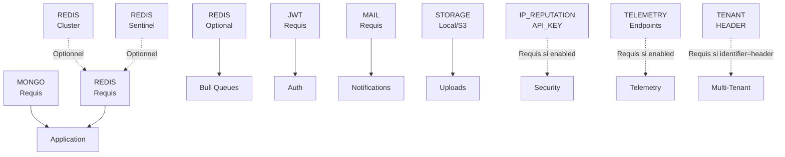

# 🚀 Variables d'Environnement - Référence Rapide

## ⚠️ Variables Obligatoires (Blocantes)

| Variable | Type | Exemple | Description |
|----------|------|---------|-------------|
| `BASE_URL` | URI | `https://api.example.com` | URL publique de base |
| `MONGODB_URI` | URI | `mongodb://localhost:27017/starter` | Connexion MongoDB |
| `JWT_SECRET` | string | `k9mL2pQ4vX7nR3sT...` | Secret access token |
| `JWT_REFRESH_SECRET` | string | `x2nP9sK4vL7mR3wQ...` | Secret refresh token |
| `MAIL_HOST` | string | `smtp.gmail.com` | Hôte SMTP |
| `MAIL_USER` | string | `user@gmail.com` | Identifiant SMTP |
| `MAIL_PASSWORD` | string | `app_password` | Mot de passe SMTP |
| `MAIL_FROM` | email | `noreply@example.com` | Adresse d'expédition |

---

## 📊 Tableau Complet (60 Variables)

### Application (7 variables)

```env
NODE_ENV=development                              # development, production, test
BASE_URL=https://api.example.com                  # [REQUIS]
PORT=3000
CORS_ENABLED=true
CORS_ALLOWED_ORIGINS=https://app.example.com
LOG_LEVEL=info                                    # error, warn, info, debug, verbose
API_PREFIX=api
```

### MongoDB (8 variables)

```env
MONGODB_URI=mongodb://localhost:27017/starter     # [REQUIS]
MONGODB_DEBUG=false
MONGODB_POOL_SIZE=10
MONGODB_REPLICA_SET=                              # Optionnel
MONGODB_SSL=false
MONGODB_AUTH_SOURCE=                              # Optionnel
MONGODB_RETRY_WRITES=true
MONGODB_READ_PREFERENCE=primary
```

### Redis - Standalone (5 variables)

```env
REDIS_HOST=localhost                              # [REQUIS]
REDIS_PORT=6379
REDIS_PASSWORD=                                    # Optionnel
REDIS_DB=0
REDIS_TLS=false
```

### Redis - Cluster Mode (2 variables)

```env
REDIS_CLUSTER_ENABLED=false
REDIS_CLUSTER_NODES=redis1:6379,redis2:6379    # [REQUIS si enabled]
```

### Redis - Sentinel Mode (3 variables)

```env
REDIS_SENTINEL_ENABLED=false
REDIS_SENTINEL_NODES=sentinel1:26379,sentinel2:26379  # [REQUIS si enabled]
REDIS_SENTINEL_MASTER_NAME=mymaster               # [REQUIS si enabled]
```

### JWT (6 variables)

```env
JWT_SECRET=k9mL2pQ4vX7nR3sT...                   # [REQUIS]
JWT_REFRESH_SECRET=x2nP9sK4vL7mR3wQ...          # [REQUIS]
JWT_EXPIRES_IN=15m
JWT_REFRESH_EXPIRES_IN=7d
JWT_ISSUER=my-app                                 # Optionnel
JWT_AUDIENCE=my-app-users                         # Optionnel
```

### Stockage - Local (2 variables)

```env
STORAGE_DRIVER=local
LOCAL_STORAGE_PATH=./uploads                      # [REQUIS si driver=local]
```

### Stockage - S3 (6 variables)

```env
S3_BUCKET=my-bucket                               # [REQUIS si driver=s3]
S3_REGION=eu-west-1                               # [REQUIS si driver=s3]
S3_ACCESS_KEY=AKIA...                             # [REQUIS si driver=s3]
S3_SECRET_KEY=...                                 # [REQUIS si driver=s3]
S3_ENDPOINT=http://minio:9000                     # Optionnel
S3_FORCE_PATH_STYLE=false
```

### Email SMTP (6 variables)

```env
MAIL_HOST=smtp.gmail.com                          # [REQUIS]
MAIL_PORT=587
MAIL_USER=user@gmail.com                          # [REQUIS]
MAIL_PASSWORD=app_password                        # [REQUIS]
MAIL_FROM=noreply@example.com                     # [REQUIS]
MAIL_SECURE=false
```

### Files d'Attente Bull (5 variables)

```env
QUEUE_REDIS_HOST=localhost
QUEUE_REDIS_PORT=6379
QUEUE_REDIS_PASSWORD=                             # Optionnel
QUEUE_REDIS_DB=1
QUEUE_PREFIX=bull
```

### Sécurité (9 variables)

```env
BRUTE_FORCE_ENABLED=true
BRUTE_FORCE_MAX_ATTEMPTS=5
BRUTE_FORCE_WINDOW=300
BRUTE_FORCE_BLOCK_DURATION=900
IP_REPUTATION_ENABLED=false
IP_REPUTATION_API_KEY=                            # [REQUIS si enabled]
AUDIT_LOG_ENABLED=true
REFRESH_TOKEN_ROTATION_ENABLED=true
REFRESH_TOKEN_REUSE_DETECTION=true
```

### Télémétrie (4 variables + endpoints conditionnels)

```env
TELEMETRY_ENABLED=false
TELEMETRY_SERVICE_NAME=backend-starter
TELEMETRY_EXPORTER=console                        # console, otlp, jaeger, zipkin
TELEMETRY_OTLP_ENDPOINT=http://collector:4318     # [REQUIS si exporter=otlp]
# TELEMETRY_JAEGER_ENDPOINT=http://jaeger:14268   # [REQUIS si exporter=jaeger]
# TELEMETRY_ZIPKIN_ENDPOINT=http://zipkin:9411    # [REQUIS si exporter=zipkin]
```

### Métriques (3 variables)

```env
METRICS_ENABLED=false
METRICS_ENDPOINT=/metrics
METRICS_PREFIX=app_
```

### Multi-Tenant (4 variables)

```env
MULTI_TENANT_ENABLED=false
TENANT_IDENTIFIER=header                          # header, subdomain, jwt
TENANT_HEADER=X-Tenant-ID                         # [REQUIS si identifier=header]
TENANT_DB_ISOLATION=none                          # database, schema, collection
```

### Idempotence (4 variables)

```env
IDEMPOTENCY_ENABLED=true
IDEMPOTENCY_TTL=86400
IDEMPOTENCY_KEY_HEADER=Idempotency-Key
IDEMPOTENCY_PREFIX=idempotency:
```

### Feature Flags (3 variables)

```env
FEATURE_FLAGS_ENABLED=true
FEATURE_FLAGS_PROVIDER=env                        # env, redis, database
FEATURE_FLAGS_CACHE_TTL=60
```

### Résilience (9 variables)

```env
CIRCUIT_BREAKER_ENABLED=true
CIRCUIT_BREAKER_TIMEOUT=5000
CIRCUIT_BREAKER_ERROR_THRESHOLD=50
CIRCUIT_BREAKER_RESET_TIMEOUT=30000
RETRY_ENABLED=true
RETRY_MAX_ATTEMPTS=3
RETRY_BACKOFF=1000
TIMEOUT_ENABLED=true
TIMEOUT_DEFAULT=10000
```

### Logs d'Activité (1 variable)

```env
ACTIVITY_LOGS_RETENTION_DAYS=90
```

---

## 🔗 Dépendances Entre Modules



---

## ✅ Checklist de Déploiement

### Développement Local

- [ ] `NODE_ENV=development`
- [ ] `MONGODB_URI` pointant vers MongoDB local
- [ ] `REDIS_HOST` pointant vers Redis local
- [ ] Secrets JWT générés (peuvent être faibles en dev)
- [ ] MAIL configuré (peut pointer vers mailtrap, etc.)
- [ ] `STORAGE_DRIVER=local` avec dossier `uploads/` existant
- [ ] Le reste peut utiliser les valeurs par défaut

### Tests

- [ ] `NODE_ENV=test`
- [ ] Toutes les variables obligatoires remplies
- [ ] Services externes (MAIL, S3, etc.) mockés ou désactivés
- [ ] Database test isolée

### Production

- [ ] ✅ TOUTES les variables obligatoires
- [ ] Secrets JWT forts (32+ caractères)
- [ ] `BASE_URL` exact (utilisé dans les liens)
- [ ] MAIL configuré correctement
- [ ] STORAGE configuré (S3 recommandé)
- [ ] Redis avec authentification
- [ ] MongoDB avec pool size adapté
- [ ] HTTPS activé (CORS_ALLOWED_ORIGINS valide)
- [ ] Logs au niveau `info`
- [ ] `LOG_LEVEL=warn` ou `error` en prod

---

## 🔐 Sécurité des Secrets

### Générer des Secrets Forts

```bash
# Bash
openssl rand -base64 32

# NodeJS
node -e "console.log(require('crypto').randomBytes(32).toString('base64'))"

# Python
python3 -c "import secrets; print(secrets.token_urlsafe(32))"
```

### Où Stocker les Secrets

| Environnement | Recommandation |
|:---:|:---|
| **Dev Local** | `.env` (ignoré par git) |
| **Tests CI** | Variables d'env du pipeline (GitHub Secrets, etc.) |
| **Production** | Vault, AWS Secrets Manager, HashiCorp Consul, 1Password |

### Pattern Sécurisé

```bash
# ❌ MAUVAIS
git add .env

# ✅ BON
echo ".env" >> .gitignore
git add .env.example  # structure uniquement
cp .env.example .env
# Remplir .env en local
```

---

## 📞 Support

Pour des détails complets, voir : **ENV_CONFIGURATION_GUIDE.md**

Généré: 9 mars 2026 | NestJS Backend Starter
